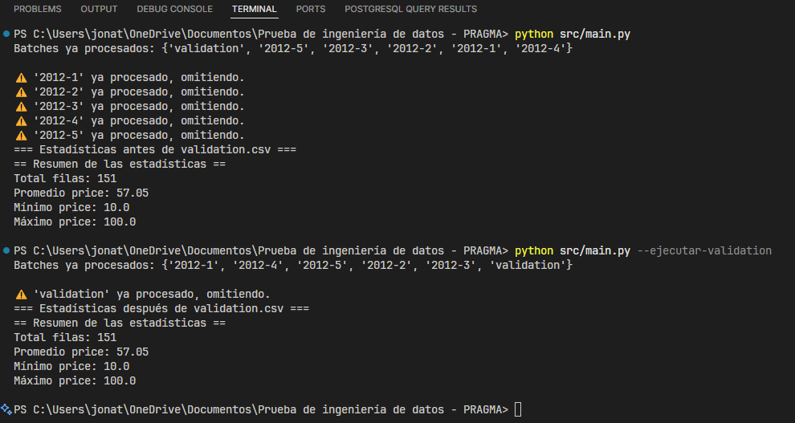

# Prueba de Ingeniería de Datos – PRAGMA

## Descripción General

Este proyecto resuelve una prueba técnica de ingeniería de datos, cuyo objetivo es construir un pipeline de datos que procese archivos CSV en microbatches, almacene los datos en una base de datos relacional y mantenga estadísticas acumuladas en tiempo real, sin recalcular sobre toda la data ya cargada.

## Estructura del Proyecto
```
├── data/                  # Archivos CSV de entrada
├── src/
│   ├── main.py            # Script principal de orquestación
│   ├── config/            # Configuración de la base de datos
│   ├── etl/               # Lógica de la ETL (Extracción, Transformación, Carga)
│   ├── models/            # Modelos/repositorios de tablas
├── requirements.txt       # Dependencias Python
├── docker-compose.yml     # Configuración de PostgreSQL vía Docker
├── .env                   # Variables de entorno para la conexión a la base de datos
├── README.md              # Documentación del proyecto
└── .gitignore             # Archivos a ignorar por Git
```

## ¿Qué hace el pipeline?
- Procesa los archivos CSV uno por uno (nunca todos en memoria).
- Inserta los datos en la tabla `transactions` de PostgreSQL.
- Calcula y actualiza estadísticas acumuladas (count, promedio, min, max de `price`) tras cada fila y lote.
- Guarda la evolución de las estadísticas por lote en la tabla `agg_stats`.
- Permite procesar el archivo `validation.csv` en un segundo momento y muestra el impacto en las estadísticas.
- Imprime la evolución de las estadísticas en consola y el resumen final antes y después de cargar `validation.csv`.

## Instalación y Ejecución

1. **Clona el repositorio y navega al directorio:**
   ```powershell
   git clone https://github.com/jblandon97/Prueba-de-ingenier-a-de-datos---PRAGMA.git
   cd "Prueba de ingeniería de datos - PRAGMA"
   ```

2. **Instala las dependencias:**
   ```powershell
   pip install -r requirements.txt


3. **Configura las variables de entorno en `.env` (ya provisto) para la conexión a la base de datos. A continuación se muestra un ejemplo:**
   ```env
   DB_USER=postgres
   DB_PASS=postgres
   DB_HOST=localhost
   DB_PORT=5432
   DB_NAME=mydatabase
   ```

4. **Levanta la base de datos PostgreSQL con Docker:**
   ```powershell
   docker-compose up -d
   ```

5. **Ejecuta el pipeline para cargar los archivos principales (sin validation.csv):**
   ```powershell
   python src/main.py
   ```

6. **Para procesar `validation.csv` en un segundo momento:**
   ```powershell
   python src/main.py --ejecutar-validation
   ```

## Esquema de la Base de Datos

### Tabla: `transactions`
| Columna    | Tipo      | Descripción                                 |
|------------|-----------|---------------------------------------------|
| id         | SERIAL PK | Identificador único de la transacción       |
| timestamp  | TIMESTAMP | Fecha y hora del evento                     |
| user_id    | TEXT      | Identificador del usuario                   |
| price      | FLOAT     | Valor de la transacción                     |

### Tabla: `agg_stats`
| Columna      | Tipo      | Descripción                                         |
|--------------|-----------|-----------------------------------------------------|
| load_batch   | TEXT PK   | Nombre del lote procesado (ej: "2012-1.csv")        |
| cum_count    | INTEGER   | Recuento acumulado de filas hasta ese lote          |
| cum_avg      | FLOAT     | Promedio acumulado de `price`                       |
| cum_min      | FLOAT     | Valor mínimo acumulado de `price`                   |
| cum_max      | FLOAT     | Valor máximo acumulado de `price`                   |
| last_updated | TIMESTAMP | Fecha y hora de la actualización de estadísticas    |

### Tabla: `ingested_files`
| Columna     | Tipo      | Descripción                                 |
|-------------|-----------|---------------------------------------------|
| batch_name  | TEXT PK   | Nombre del archivo/lote procesado           |
| loaded_at   | TIMESTAMP | Fecha y hora de la carga                    |

## Comprobación de Resultados

Al finalizar la ejecución del pipeline, se debe comprobar:

1. **Estadísticas en ejecución:**  
   Se imprimen en consola tras cada lote y tras cada fila (count, promedio, min, max de `price`).

2. **Consulta en la base de datos:**  
   - Recuento total de filas (`count`)
   - Valor promedio (`avg`)
   - Valor mínimo (`min`)
   - Valor máximo (`max`)
   sobre la tabla `transactions`.

3. **Carga de `validation.csv`:**  
   - Ejecuta el pipeline con el archivo de validación.
   - Muestra el cambio en las estadísticas en ejecución y en la base de datos.

---

### Ejemplo de Resultados

- Estadísticas tras cada lote antes de cargar `validation.csv`:

  
  
  

- Consulta de las tablas `transactions` y `agg_stats` antes de cargar `validation.csv`:

  

- Estadísticas después de cargar `validation.csv`:

  

- Consulta de las tablas `transactions` y `agg_stats` después de cargar `validation.csv`:
  
  

Si se vuelve a ejecutar el pipeline, se debe observar que los archivos ya procesados no se vuelven a cargar y las estadísticas no se actualizan, manteniendo la integridad de los datos.

- Consulta de las tablas `transactions` y `agg_stats` tras re-ejecución:

   

## Notas Técnicas

- Las estadísticas se actualizan de forma incremental, sin recalcular sobre toda la tabla.
- El diseño permite auditar la evolución de las estadísticas por lote.
- Puedes administrar la base de datos con PgAdmin, la línea de comandos u otra herramienta. En mi caso, utilicé la extensión de PostgreSQL de Microsoft para Visual Studio Code. Deberás configurar la conexión con las mismas variables de entorno que en el archivo `.env`.
